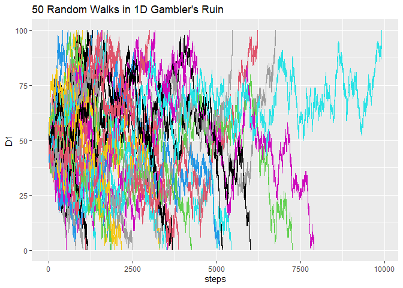
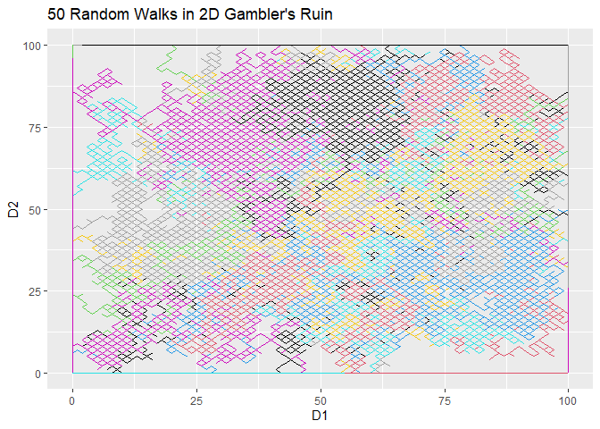
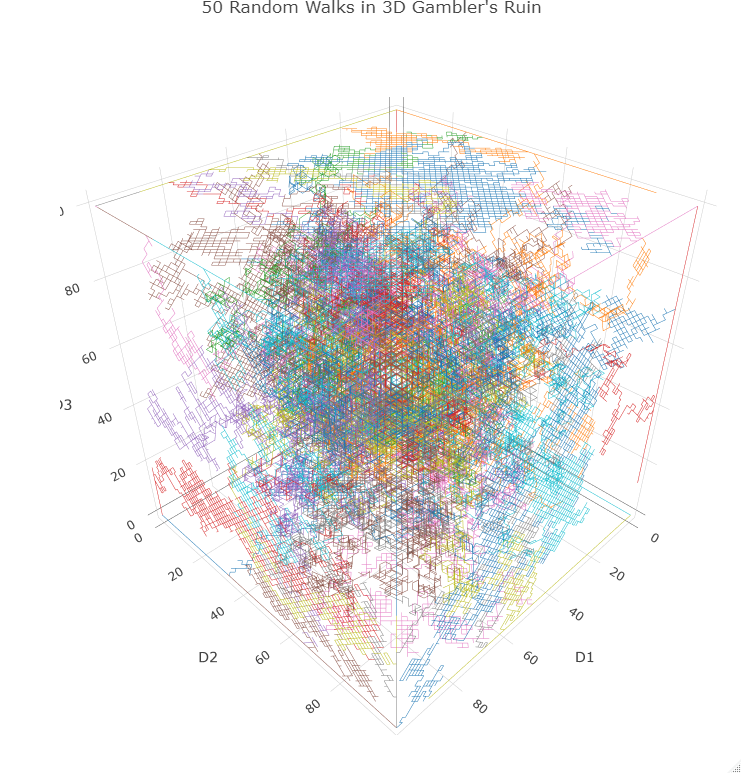

Gamblers Ruin
================
Thanos Livanis
11/12/2023

## Generalization of Gambler’s Ruin

``` r
library(tidyverse)
library(plotly)

# walk in 1D, 2D, 3D
plot_walk <- function(walk, dim, n = 1) {
  
  if (dim > 3) {
    print(paste("Cant plot in", dim, "dimensions"))
    return (NULL)
  }
  
  if (is.data.frame(walk)) walk <- list(walk)
  n <- min(n, length(walk))

  title <- paste0(n, " Random Walks in ", dim, "D", " Gambler's Ruin")
  
  if (dim == 1) {
    pl <- ggplot() + ggtitle(title)
    for (i in 1:n) pl <- pl + geom_line(data = walk[[i]], aes(steps, D1), color = i) 
  } else if (dim == 2) {
    pl <- ggplot() + ggtitle(title)
    for (i in 1:n) pl <- pl + geom_path(data = walk[[i]], aes(D1, D2), color = i)
  } else if (dim == 3) {
    pl <- plot_ly(width = 800, height = 800, type = 'scatter3d', mode = 'lines') %>% layout(title = title)
    for (i in 1:n) {
      pl <- pl %>% add_trace(data = walk[[i]], x = ~D1, y = ~D2, z = ~D3,
                            line = list(color = i, width = 1), showlegend = F)
    }
  }

  print(pl)
}
```

``` r
# simulate an instance of Gambler's ruin in N Dimensions {N independent Games}
# Random walk ends when all games have finished (final capital either 0 or M)
simulate_gr <- function(starting_capital, target_capital, prop, dim = 1, plot = F) {
  
  simulate_1d <- function() {
    
    capital <- starting_capital
    series <- c(starting_capital)
    
    while (capital < target_capital && capital > 0) {
      
      stake <- min(capital, 1)
      capital <- capital + stake*ifelse(rbinom(1, 1, prop) == 1, 1, -1)
      
      series <- c(series, capital)
    }
    
    return (series)
  }

  df_format <- function(lst) {
    
    max_walk <- max(sapply(lst, length))

    df <- lapply(lst, function(v) c(v, rep(tail(v, 1), max_walk - length(v)))) %>% 
      setNames(paste0("D", 1:length(lst))) %>%
      bind_cols() %>%
      mutate(steps = as.numeric(row.names(.)) - 1, .before = "D1")
  }
  
  walk <- replicate(dim, simulate_1d(), simplify = F) %>% df_format

  if (plot) plot_walk(walk, dim)
  
  return (walk)
}

# simulate gambler's ruin repetitively and aggregate results 
simulate <- function(starting_capital, target_capital, prop, dim = 1, plot = F) {
  
  set.seed(1)
  
  params <- as.list(environment())[1:4]
  
  nsims <- 1000

  mc_results <- replicate(nsims, simulate_gr(starting_capital, target_capital, prop, dim), simplify = F) 
  
  if (plot) plot_walk(mc_results, dim, 50)
    
  sim <- map_dfr(mc_results, function(df) {df[nrow(df), ]}) %>%
    mutate_at(vars(starts_with("D")), ~ifelse(. != 0, 1, 0)) %>%
    rowwise() %>% mutate(R = prod(c_across(starts_with("D")))) %>%
    ungroup() %>% 
    summarize(win_prop = mean(R), 
              walk_exp = mean(steps), 
              walk_longest = max(steps)) %>%
    bind_cols(params) 
  
  return (sim)
}
```

**1D Simulation**

``` r
simulate(50, 100, 0.5, 1, T)
```

<!-- -->

    ## # A tibble: 1 × 7
    ##   win_prop walk_exp walk_longest starting_capital target_capital  prop   dim
    ##      <dbl>    <dbl>        <dbl>            <dbl>          <dbl> <dbl> <dbl>
    ## 1    0.493    2470.        18800               50            100   0.5     1

**2D Simulation**

``` r
simulate(50, 100, 0.5, 2, T)
```

<!-- -->

    ## # A tibble: 1 × 7
    ##   win_prop walk_exp walk_longest starting_capital target_capital  prop   dim
    ##      <dbl>    <dbl>        <dbl>            <dbl>          <dbl> <dbl> <dbl>
    ## 1    0.235    3469.        18800               50            100   0.5     2

**3D Simulation**

``` r
simulate(50, 100, 0.5, 3, T)
```

    ## # A tibble: 1 × 7
    ##   win_prop walk_exp walk_longest starting_capital target_capital  prop   dim
    ##      <dbl>    <dbl>        <dbl>            <dbl>          <dbl> <dbl> <dbl>
    ## 1    0.129    4132.        18800               50            100   0.5     3


