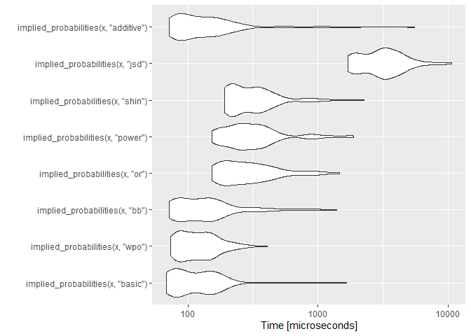
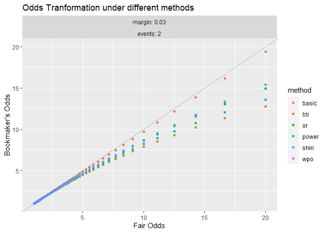
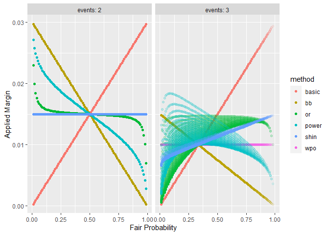
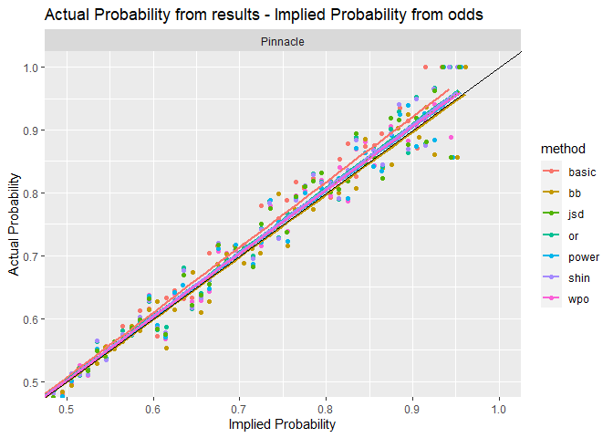
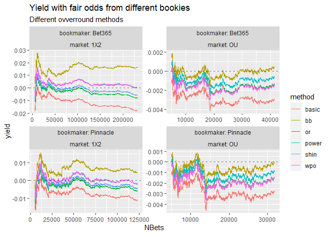
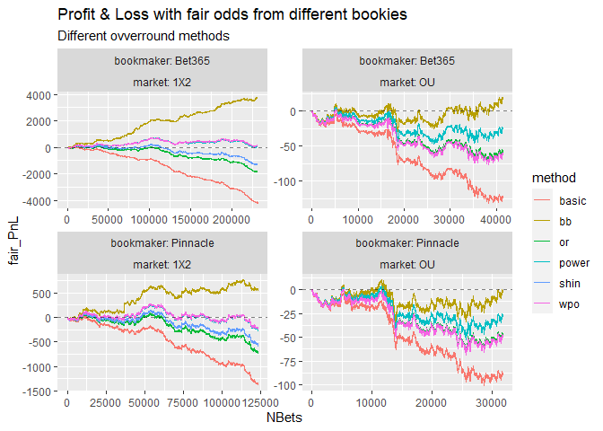

Bookmaker’s Overround
================
23/11/2023

**Bookmaker’s overround: Evaluating different methods to remove
bookmaker’s overround in football odds**

A reproduction in R of the methodology & results from: [Wisdom of
Crowd-Joseph
Buchdahl](https://www.football-data.co.uk/The_Wisdom_of_the_Crowd_updated.pdf). 
There are some additional methods that are included in the [implied
package](https://opisthokonta.net/?p=1797) and application to OU odds.

Data from
[football-data.co.uk](https://www.football-data.co.uk/data.php)  

## Load data

``` r
rm(list = ls())

library(rvest) #read_html
library(data.table)
library(reshape2) 
library(implied)
library(tidyverse)
library(microbenchmark)

options(scipen = 999)

# download league data from Football-data.co.uk
load_league_data <- function(league) {
  
  url_main <- "https://www.football-data.co.uk/"
  url_league <- paste0(url_main, league, "m.php")
  
  links <- read_html(url_league) %>% html_nodes("a") %>% html_attr("href")
  
  # main leagues end in (1|0).csv
  csv_links <- paste0(url_main, links[grep("(1|0)\\.csv$", links)])  
  
  read_url <- function(URL) { 
    tryCatch(read.csv(URL, stringsAsFactors = F, check.names = F, na.strings = c("NA", "")),
             error = function(e) {warning(conditionMessage(e)); NULL})
  }
  
  data <- lapply(csv_links, read_url)
  
  return (data)
}

leagues <- c("england", "scotland", "germany", "italy", "spain", 
             "france", "netherlands", "belgium", "portugal")

# Load all CSV files into a list
football_odds <- lapply(leagues, load_league_data) 

# Merge into a single dataframe & remove any NA rows and cols with very few observations (< 100)
football_odds <- football_odds %>% do.call(c, .) %>% rbindlist(fill = T) %>% 
  as.data.frame() %>% .[rowSums(is.na(.)) != ncol(.), colSums(is.na(.)) < nrow(.) - 100]
```

``` r
# Odds Abbreviations for 1x2 in Football-data.co.uk, C at the end of bookmaker's name indicates Closing odds
odds_1X2 <- list(Bet365 = c("B365H", "B365D", "B365A"), Bet365C = c("B365CH", "B365CD", "B365CA"),
                 Bwin = c("BWH", "BWD", "BWA"), BwinC = c("BWCH", "BWCD", "BWCA"), 
                 Interwetten =  c("IWH", "IWD", "IWA"), InterwettenC = c("IWCH", "IWCD", "IWCA"),
                 Pinnacle = c("PSH", "PSD", "PSA"), PinnacleC = c("PSCH", "PSCD", "PSCA"),
                 WilliamHill = c("WHH", "WHD", "WHA"),  WilliamHillC = c("WHCH", "WHCD", "WHCA"),
                 VC = c("VCH", "VCD", "VCA"), VCC = c("VCCH", "VCCD", "VCCA"),
                 Market_Avg = c("AvgH", "AvgD", "AvgA"),  Market_AvgC = c("AvgCH", "AvgCD", "AvgCA"),
                 Betbrain_Avg = c("BbAvH", "BbAvD", "BbAvA"),
                 Sportingbet =  c("SBH", "SBD", "SBA"),
                 Blue_Square =  c("BSH", "BSD", "BSA")) 


# Odds Abbreviations for Over-Under 
odds_OU <- list(Bet365 = c("B365>2.5", "B365<2.5"), Bet365C = c("B365C>2.5", "B365C<2.5"), 
                Pinnacle = c("P>2.5", "P<2.5"), PinnacleC = c("PC>2.5", "PC<2.5"),
                Market_Avg = c("Avg>2.5", "Avg<2.5"), Market_AvgC = c("AvgC>2.5", "AvgC<2.5"))

odds_abbs <- list('1X2' = odds_1X2, OU = odds_OU)

# Columns with odds to numeric
football_odds <- football_odds %>% mutate_at(vars(unlist(odds_abbs)), as.numeric)

# OU result (Full time 2.5 Line)
football_odds <- football_odds %>%
  mutate(ID = as.numeric(rownames(.)),
         FTL = ifelse(FTHG + FTAG > 2, "O", "U"))
```

## Evaluating Computational Complexity of different methods

-   basic, wpo, bb, additive 1-1 transformation same complexity  
-   power, or, shin uniroot
-   jsd very computationally expensive

``` r
# methods used in 'implied_probabilities' from implied Package
methods <- c("basic", "wpo", "bb", "or", "power", "shin", "jsd", "additive")

x <- c(1.5, 3.5, 7.5)

res <- microbenchmark(list = lapply(methods, function(method) {bquote(implied_probabilities(x, .(method)))})) 
autoplot(res)
```

<!-- -->

## Odds transformation

**How fair odds are mapped to ‘biased’ odds under different methods**

``` r
# mapping fair probabilities to overround probabilities, based on & method & number of events & margin 
odds_mapper <- function(method, events, margin = 0.03) {
  
  params <- as.list(environment())
    
  # Generate grid of fair probabilities - all possible combination with step 0.1
  # can't allocate enough memory if events > 3| consider increasing step
  fair_props <- do.call(expand.grid, replicate(events, seq(0.01, 0.99, 0.01), simplify = FALSE)) %>% 
    filter(rowSums(.) == 1) %>% setNames(paste0("P", 1:events))
  
  bookmakers_odds  <- implied_odds(fair_props, method, margin) %>% .[["odds"]] %>%
    as.data.frame() %>% setNames(paste0("O", 1:events))
  
  odds <- bind_cols(fair_props, bookmakers_odds) %>% select(P1, O1) %>%
    mutate(returns = P1*O1) %>% bind_cols(params) %>%
    mutate_at(vars("events", "margin"), as.character)
  
  return (odds)
}


# method jsd is not supported with 'implied_odds'
# additive method seems to produce identical results with wpo, excluding both
odds <- data.frame(method = rep(methods[1:6], each = 2),
                   events = c(2, 3)) %>%
  pmap(odds_mapper) %>%
  bind_rows() 
```

**Shortening long odds:** *bb \> … \> basic*  

``` r
odds %>% filter(events == 2) %>%
  ggplot(aes(x = 1/P1, y = O1, color = method)) +
  geom_point() + 
  geom_abline(slope = 1, intercept = 0, linetype = 3) +
  facet_wrap(margin ~ events , labeller = label_both) +
  coord_cartesian(xlim = c(1, 20), ylim = c(1, 20)) +
  labs(x = "Fair Odds", y = "Bookmaker's Odds", title = "Odds Tranformation under different methods")  
```

<!-- -->

**Applied Margin is the difference of overround probability (1/odds) and
fair probability**  
The basic method has a completely different mapping compared to the
other methods  
When events \> 2, mapping is not 1-1 for some methods. The root of an
equation depends also upon the other probabilities

``` r
odds %>% 
  ggplot(aes(x = P1, y = 1/O1 - P1, color = method)) +
  geom_point(aes(alpha =events)) +
  facet_wrap(events ~., labeller = label_both) +
  scale_alpha_manual(name = NULL, values=c(1, 0.1)) +
  labs(x = "Fair Probability", y = "Applied Margin") +
  guides(alpha = "none") 
```

<!-- -->

## Efficiency of overround removal methods

### A. Actual (from results) Probability vs implied (from odds) Probability

``` r
# using implied_probabilities from implied package
# arriving at a set of fair probabilities (after removing any 'problematic' calculations)
fair_probabilities <- function(data, bookmaker, market, method) {
  
  odds <- odds_abbs[[market]][[bookmaker]] 
  
  # filter NA or invalid odds (overround > 1, all odds > 1)
  valid_overround <- rowSums(1/data[, odds], na.rm = T) > 1
  
  res <- if (market == "1X2") "FTR" else "FTL"
  
  data <- data[valid_overround, c(odds, res)] %>%
    filter(across(all_of(odds), ~. > 1))
  
  
  fair_props <- data[, odds] %>% implied_probabilities(method) 
  
  is_ok <- which(!fair_props[["problematic"]])  
  fair_props <- fair_props %>% .[["probabilities"]] %>% as.data.frame()
  
  fair_props <- if (market == "1X2") 
    setNames(fair_props, c("PH", "PD", "PA")) 
  else 
    setNames(fair_props, c("PO", "PU"))
  
  data <- bind_cols(data[is_ok, ], fair_props[is_ok, ]) %>% na.omit()
  
  return (data)
}
```

``` r
# props table & plot with implied prop from actual results (1x2)  & implied prop from bookmaker
actual_implied_probability <- function(data, bookmaker, method) {
  
  # Add fair probabilities and transform to long format
  props <- fair_probabilities(data, bookmaker, "1X2", method) %>%
    dplyr::select(PH, PD, PA, FTR) %>%
    setNames(c("H", "D", "A", "FTR")) %>%
    melt(measure.vars = c("H", "D", "A"), variable.name = "Selection", value.name = "implied_probability") %>%
    mutate(evaluation = ifelse(FTR == Selection, 1, 0))
  

  prop_table <- na.omit(props) %>% 
    mutate(implied_prop_int = cut(implied_probability, breaks = seq(0, 1, 0.01))) %>%
    group_by(implied_prop_int) %>%
    summarise(obs = n(), 
              implied_prop = mean(implied_probability),
              correct = sum(evaluation), 
              actual_prop = correct/obs, 
              method = method, 
              bookmaker = bookmaker)
  
  pl <- ggplot(prop_table, aes(x = implied_prop, y = actual_prop)) +
    geom_point() + geom_smooth(method = "lm", mapping = aes(weight = obs)) + 
    geom_abline(slope = 1, intercept = 0) +
    labs(title = paste0("Actual Probability from results - Implied Probability from ", bookmaker, "'s odds"), 
         subtitle = paste("Overround method:", method), 
         x = "Implied Probability", y = "Actual Probability")
  #print(pl)
  
  return(prop_table)
}

prop_tables <- map(methods[1:7], actual_implied_probability, 
                   data = football_odds, bookmaker = "Pinnacle") %>% bind_rows()


ggplot(prop_tables, aes(x = implied_prop, y = actual_prop, color = method)) +
  geom_point() + geom_smooth(method = "lm", mapping = aes(weight = obs), se = F) + 
  geom_abline(slope = 1, intercept = 0) +
  facet_wrap(bookmaker ~.) +
  labs(title = "Actual Probability from results - Implied Probability from odds",
       x = "Implied Probability", y = "Actual Probability") +
  coord_cartesian(xlim = c(0.5, 1), ylim = c(0.5, 1))
```

<!-- -->

### B - Fair Yield & PnL

``` r
fair_returns <- function(data, bookmaker, market, method) {

  if (market == "OU" && method == "shin") return (NULL)

  data <- fair_probabilities(data, bookmaker, market, method)
  
  # fair_PnL = Profit n Loss if bet on fair odds of all outcomes 
  if (market == "1X2") {
  data <- data %>% 
    mutate(fair_PnL = -3 + ifelse(FTR == "H", 1/PH, ifelse(FTR == "D", 1/PD, 1/PA)))
  } else {
    data <- data %>% 
      mutate(fair_PnL = -2 + ifelse(FTL == "O", 1/PO, 1/PU))
  }
  
  events = ifelse(market == "1X2", 3, 2)
  
  fair_bets <- data %>%
    transmute(NBets = seq(events, by = events, length.out = nrow(.)), 
              fair_PnL = cumsum(data$fair_PnL), 
              yield = fair_PnL/NBets, 
              method = method, 
              bookmaker = bookmaker,
              market = market)
              
  
  return (fair_bets)
}


fair_bets <- data.frame(method = rep(methods[1:6], each = 4),
                        bookmaker = rep(c("Bet365", "Pinnacle"), each = 2),
                        market = c("1X2", "OU")) %>%
  pmap(fair_returns, data = football_odds) %>%
  bind_rows()
```

**power & wpo most efficient way to remove overround in 1X2**  
yield for O/U is negligible with all methods, since it is usually a
50-50 line. bb and power maybe a little more reliable

``` r
fair_bets %>% filter(NBets > 5000) %>% 
  ggplot(aes(x = NBets, y = yield, color = method)) + 
  geom_line() + 
  geom_hline(yintercept = 0, linetype = "dashed", alpha = 0.5) +
  facet_wrap(bookmaker ~ market, labeller = label_both, scales = "free") +
  labs(title = "Yield with fair odds from different bookies",
       subtitle = "Different ovverround methods")
```

<!-- -->

``` r
fair_bets %>% 
  ggplot(aes(x = NBets, y = fair_PnL, color = method)) + 
  geom_line() + 
  geom_hline(yintercept = 0, linetype = "dashed", alpha = 0.5) +
  facet_wrap(bookmaker ~ market, labeller = label_both, scales = "free") +
  labs(title = "Profit & Loss with fair odds from different bookies",
       subtitle = "Different ovverround methods")
```

<!-- -->
