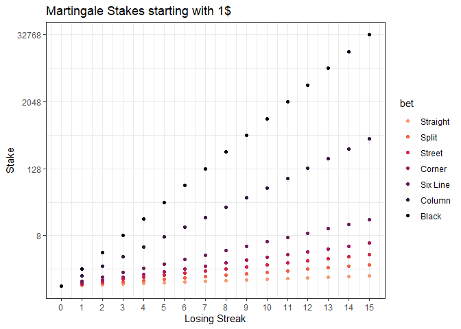

Roulette Strategy
================
Thanos Livanis
13/12/2023

**Analysis & simulation of *Gambler’s Ruin* problem in roulette under
different options and betting strategies**

- [Analysis](#analysis)
  - [Yield](#yield)
  - [Profit Probability](#profit-probability)
  - [Applied Margin](#applied-margin)
- [Gambler’s Ruin](#gamblers-ruin-in-roulette)
  - [Description](#description)
  - [Martingale](#martingale)
  - [Simulation](#simulation)
    - [Roulette Ruin](#roulette-ruin)
    - [Casino Night](#casino-night)

``` r
suppressPackageStartupMessages({
  library(ggpubr)
  library(viridis)
  library(tidyverse)
})

rm(list = ls())
options(scipen = 999)
set.seed(1)

# types of bets with different Payouts
roulette_table <- tribble(
  ~bet,       ~n,   ~payout,
  "Straight",  1,    35,  
  "Split",     2,    17,
  "Street",    3,    11,
  "Corner",    4,    8,
  "Six Line",  6,    5,
  "Column",    12,   2,
  "Black",     18,   1)

roulette_table$bet <- factor(roulette_table$bet, levels = roulette_table$bet)

roulette_table <- bind_rows(roulette_table %>% mutate(type = "European"), 
                            roulette_table %>% mutate(type = "American")) %>%
  relocate(type, .before = bet) %>%
  mutate(prop = ifelse(type == "European", n/37, n/38), 
         EV = prop*(payout + 1) - 1)
```

## Analysis

### Yield

``` r
wheel_sim <- expand.grid(type = c("European", "American"),
                         bet = unique(roulette_table$bet),
                         nspins = seq(1000, 20000, 1000), 
                         nsim = seq(1, 5000, 1)) %>% 
  left_join(roulette_table[, c("bet", "type", "payout", "prop")], by = c("type", "bet")) %>%
  # simulate binomial successes
  mutate(success = mapply(function(n, p) rbinom(1, size = n, prob = p), nspins, prop)) %>%
  mutate(PnL = success*payout - (nspins - success), 
         yield = PnL/nspins)

wheel_sim %>% 
  filter(type == "European", nspins == 1000) %>%
  ggplot(aes(x = bet, y = yield, fill = bet)) +
  geom_boxplot() +
  scale_y_continuous(breaks = seq(-0.8, 0.8, 0.1), labels = scales::percent_format(accuracy=1)) +
  scale_fill_viridis(discrete = T, option = "F", direction = -1) + theme_bw() + 
  theme(axis.title.x = element_blank(), 
        axis.text.x = element_text(angle = 90, vjust = 0.5, hjust = 1,size = 12), 
        legend.position="none") + 
  labs(title = "Yield distribution ~ 1000 European Roulette Spins")
```

<!-- -->

### Profit Probability

If we spin the Roulette N times and win M bets:
$\text{PnL} = M \cdot \text{payout} - (N - M)$. Thus:
$M > \frac{N}{\text{payout} + 1}$  
$\text{Profit Probability} = P(X \ge \lceil M\rceil) = \text{pbinom}(\lfloor M\rfloor, \text{Spins}, p, \text{lower.tail = F})$

When the number of spins grows, the only possibility to make a profit is
through Straight bets due to their higher variance.

``` r
wheel_summary <- wheel_sim %>%
  summarise(p_profit_sim = sum(PnL > 0)/n(), 
            yield_avg = mean(yield),
            yield_sd = sd(yield),
            .by = c(type, bet, prop, payout, nspins)) %>%
  mutate(p_profit_binom = pbinom(nspins/(payout + 1), nspins, prop, lower.tail = F), 
         p_profit_normal = pnorm(nspins/(payout + 1), mean = nspins*prop, 
                                 sd = sqrt(nspins*prop*(1-prop)), lower.tail = F))
  
wheel_summary %>% filter(type == "European") %>%
  ggplot(aes(x = nspins, y = p_profit_normal, color = bet)) +
  geom_point() + 
  facet_grid(type ~. ) + theme_bw() + 
  scale_color_viridis(discrete = T, option = "F", direction = -1, end = 0.8) +
  labs(x = "Spins", y = "Profit Probability", title = "Probability of Profit ~ Bet|Spins") +
  theme(plot.title = element_text(hjust = 0.5))
```

<!-- -->

### Applied Margin

Suppose that we bet on a single number (Straight Bet) in European
Roulette. The decimal odds are 36, fair odds are 37, and the fair
probability is 1/37. The rest of the numbers constitute a *compound
event*, with decimal odds of 1, fair odds of 37/36 and a fair
probability of 36/37. The margin M is 1/36.

Thus fair odds of {37/36, 37} are mapped to roulette odds {1, 36},
$rouletteOdds = \frac{fairOdds}{1 + M}$ 

**Contrary to Sports betting there isn’t any longshot bias**, where the
returns from long odds are smaller than short odds. Typically in Sports
betting a margin of 1/36 applied to fair probabilities of (1/37, 36/37),
would result in odds of {22.63, 1.016}, using a method called odds
ratio. 

The margin of an event i with odds of o and probability p is:
$M_i = \frac{1}{o} - p$. Under standard methods of converting fair odds
to biased odds in Sportsbook, the applied margin decreases as p
increases. In Roulette its the opposite.

``` r
ggplot() +
  geom_point(data = roulette_table, aes(x = prop, y = 1/(payout + 1) - prop, color = bet, shape = type), size = 3) + 
  geom_abline(intercept = 0, slope = 1/36, linetype = 1) + 
  geom_abline(intercept = 0, slope = 2/36, linetype = 2) + 
  scale_color_viridis(discrete = T, option = "F", direction = -1, end = 0.8) + theme_bw() +
  labs(x = "Fair Probabillity", y = "Applied Margin")
```

<!-- -->

## Gamblers Ruin in Roulette

### Description

We will use a variation of the classic Gambler’s Ruin problem under
different betting strategies. In the classic scenario, a gambler starts
with an initial capital and on each game, the gambler wins 1 with
probability p or loses 1 with probability 1 − p. The gambler will stop
playing if either \$N are accumulated or all money has been lost.  

In our case the gambler starts with an initial capital and stops until
he is ruined, reaches his target or after a specified number of spins.
He has the option to bet on a Straight, Split, Black etc. There are
three betting strategies:

**1. Default**  
The gambler makes a constant bet, \$n.

**2. Martingale**  
The gambler starting with \$n, tries to cover all previous consecutive
losses and make a profit n\*payout. The strategy is typical for even
odds, where we double our initial stake, but can be extended to uneven
odds as well.

**3. Bold**  
The gambler bets his entire capital.

All betting strategies are limited by the current bank (we can’t bet
more than we have), we can’t bet more than the casino limit, and **we
never bet more money than we need to reach our target.**  Thus the bold
strategy doesn’t necessarily mean the gambler puts everything. If the
current bank is 80, target is 100 and betting on black, he will place
20.

### Martingale

Suppose that we bet 1\$ to an event with payout p, expecting to make p
units profit, $S_0 = 1$. If we lose, in order to cover the loss and make
p units profit, the next bet has to be:
$S_1 = \frac{p + 1}{p} = 1 + \frac{1}{p}$. If $S_{n-1} = x^{n-1}$, where
$x = 1 + \frac{1}{p}$, then after n-1 consecutive loses,
$S_n = \frac{p + x_{0} + x_{1} + \cdots + x_{n-1}}{p}$  
$S_n = \frac{p + \frac{1-x^n}{1-x}}{p} = 1 + \frac{1 - x^n}{(1-x)p}$  
Substituting x, we get:  
$S_n = x^n = (1+\frac{1}{p})^n$  

In the general case: $S_n = S_o(1+\frac{1}{p})^n$  

``` r
martingale_stakes <- function(payout, consecutive_loses, unit) {
  
  params <- as.list(environment())[1:2]
  stake <- vector("double", consecutive_loses)
  
  for (i in seq_along(stake)) 
    stake[i] <- unit + sum(stake[1:(i-1)])/payout
  
  stake <- bind_cols(params, data.frame(stake = round(unit + sum(stake)/payout, 3))) 
}

expand.grid(payout = unique(roulette_table$payout),
            consecutive_loses = 0:15) %>%
  pmap_dfr(martingale_stakes, unit = 1) %>%
  left_join(roulette_table[roulette_table$type == "European", c("payout", "bet")], by = "payout") %>%
  ggplot(aes(x = consecutive_loses, y = stake, color = bet)) +
  geom_point() +
  scale_x_continuous(breaks = 0:15) +
  scale_y_continuous(trans='log2') + 
  scale_color_viridis(discrete = T, option = "F", direction = -1, end = 0.8) + theme_bw() +
  labs(x = "Losing Streak", y = "Stake", title = "Martingale Stakes starting with 1$")
```

<!-- -->

### Simulation

``` r
# @params:
# @roulette: "European" | "American"
# @bet: {Straight, Split, Street...}
# @unit_bet: unit stake on Default Strategy and Martingale
# @max_bet: Casino limit
# @strategy: Default| Martingale | Bold
play_roulette <- function(roulette, bet, starting_bank, target_bank, unit_bet, 
                          max_bet, max_spins, strategy, plot = F) {
  
  params <- as.list(environment())[1:8]
  
  id <- which(roulette_table$type == roulette & roulette_table$bet == bet)
  prop <- roulette_table$prop[id]; payout <- roulette_table$payout[id]
  
  current_bank <- starting_bank
  losing_streak <- 0
  
  series <- vector("double", max_spins + 1); stake <- vector("double", max_spins + 1)
  
  series[1] <- current_bank
  spins <- 0
  
  stake_fun <- function(strategy) {
    if (strategy == "Default")
      function(bank, payout, ls) unit_bet
    else if (strategy == "Martingale")
      function(bank, payout, ls) unit_bet*(1 + 1/payout)^ls
    else 
      function(bank, payout, ls) bank
  }
  
  while (current_bank > 0 && current_bank < target_bank && spins < max_spins) {
    
    spins <- spins + 1
    stake_limit <- min(max_bet, current_bank, (target_bank - current_bank)/payout)
    
    bet <- stake_fun(strategy)(current_bank, payout, losing_streak) %>% min(stake_limit)
    spin <- rbinom(1, 1, prop)
    
    losing_streak <- ifelse(spin, 0, losing_streak + 1)
    
    current_bank <- current_bank + bet*ifelse(spin, payout, -1)
    
    # update containers
    stake[spins] <- bet
    series[spins + 1] <- current_bank
  }
  
  #trim vectors
  stake <- c(stake[1:spins], 0)
  series <- series[1:(spins + 1)]
  
  sim <- data.frame(spins = 0:spins, 
                    bank = series, 
                    stake = stake) %>%bind_cols(params)
  
  if (plot) {
    pl <- ggplot(sim, aes(x = spins, y = bank)) + 
      geom_line(color = "red") + labs(title = "Roulette Spinning", 
                                      subtitle = paste(c("Bet", "Strategy"), "=",  c(bet, strategy), collapse = ", "))
    print(pl)
  }
  
  return (sim)
}
```

``` r
# Typical time Series
random_spins <- expand.grid(roulette = "European",
            bet = c("Straight", "Corner", "Black"),
            starting_bank = 50,
            target_bank = 100, 
            unit_bet = 1,
            max_bet = 100, 
            max_spins = 10000,
            strategy = c("Default", "Martingale", "Bold"), stringsAsFactors = FALSE) %>%
  pmap_dfr(play_roulette) 

title_params <- function(sim) {
  
  params <- paste(c("Starting Bank", "Target Bank", "Unit", "Max Spins"), "=",
                  c(unique(sim$starting_bank), unique(sim$target_bank), 
                    unique(sim$unit_bet), unique(sim$max_spins)), collapse = ", ")
}

random_spins %>%
  ggplot(aes(x = spins, y = bank, color = bet)) +
  geom_line() +
  scale_color_viridis(discrete = T, option = "F", end = 0.8) + theme_bw() +
  facet_wrap(strategy ~ bet, scales = "free_x") +
  theme(strip.text.x = element_text(margin = margin(l = 0))) + guides(color = "none") +
  labs(title = "Random Spins", subtitle = title_params(random_spins))
```

<!-- -->

``` r
# Simulate roulette round several times and & extract stats
# Probability to reach target, to make a profit & to go bankrupt
simulate <- function(roulette, bet, starting_bank, target_bank, unit_bet, max_bet, max_spins, strategy) {
  
  nsims <- 5000
  
  mc_results <- replicate(nsims, play_roulette(roulette, bet, starting_bank, target_bank, 
                                               unit_bet, max_bet, max_spins, strategy), 
                          simplify = F) %>%
    map_dfr(~tail(., 1)) %>%
    group_by(across(-c(spins, bank, stake))) %>%
    summarize(p_profit = mean(bank > starting_bank),
              p_profit_se = sqrt(p_profit*(1-p_profit)/nsims),
              
              p_target = mean(bank >= target_bank), 
              p_target_se = sqrt(p_target*(1-p_target)/nsims),
              
              p_ruin = mean(bank == 0), 
              p_ruin_se = sqrt(p_ruin*(1-p_ruin)/nsims),
              
              bank_exp = mean(bank),
              
              spins_exp = mean(spins),
              spins_exp_se = sd(spins)/sqrt(nsims),
              spins_longest = max(spins),
              
              .groups = "drop") 
}
```

#### Roulette Ruin

Let’s simulate a variance of Gambler’s Ruin. In this scenario, given the
large number of spins, the gambler plays until he reaches his target or
is ruined under the three strategies.

The results can be summarized this way: In a game with a negative
expected value, where we play until the end, we have to limit the number
of trials; otherwise, the law of large numbers leads us to ruin. The
best strategy in this case is the bold strategy.

``` r
params_ruin <- expand.grid(roulette = "European",
                           bet = unique(roulette_table$bet),
                           starting_bank = 50,
                           target_bank = 100, 
                           unit_bet = 1,
                           max_bet = 1000, 
                           max_spins = 10^5,
                           strategy = c("Default", "Martingale", "Bold"),  stringsAsFactors = FALSE)

sim_ruin <- params_ruin %>%
  pmap_dfr(simulate, .progress = T)

pl_prop <- sim_ruin %>% 
  ggplot(aes(x = strategy, y = p_target, fill = bet)) +
  geom_bar(stat="identity", position = "dodge", color = "black") +
  geom_errorbar(aes(ymin = p_target - 1.96*p_target_se, ymax = p_target + 1.96*p_target_se, color = bet),  
                width = .2, position = position_dodge(.9), show.legend = F) + 
  scale_fill_viridis(discrete = T, option = "F", direction = -1) + 
  scale_color_viridis(discrete = T, option = "F", direction = -1) + theme_bw() +
  theme(axis.title.x = element_blank()) 
  
pl_spins <- sim_ruin %>% 
  ggplot(aes(x = strategy, y = spins_exp, fill = bet)) +
  geom_bar(stat="identity", position = "dodge", color = "black") +
  scale_y_continuous(trans='log2', breaks = 2^(0:11)) +
  scale_fill_viridis(discrete = T, option = "F", direction = -1) + theme_bw() +
  theme(axis.title.x = element_blank()) 
  
pl <- ggarrange(pl_prop, pl_spins, ncol = 2, common.legend = T, legend = "right")
annotate_figure(pl, top = text_grob(paste("Roulette Ruin\n", title_params(sim_ruin)), 
                                    face = "bold", size = 12))
```

<!-- -->

#### Casino Night

A simulation of a night at Casino. Gambler walks in with \$2000 and he
will try at most 200 spins under the 3 strategies. He aims for \$3000
and unit bet is \$10.

``` r
params_real <- expand.grid(roulette = "European",
                           bet = unique(roulette_table$bet),
                           starting_bank = 2000,
                           target_bank = 3000, 
                           unit_bet = 10,
                           max_bet = 1000, 
                           max_spins = 200,
                           strategy = c("Default", "Martingale", "Bold"), 
                           stringsAsFactors = FALSE)

sim_real <- params_real %>%
  pmap_dfr(simulate, .progress = T)

sim_real %>% 
  pivot_longer(cols = c("p_profit", "p_target", "p_ruin"), names_to = "variable") %>%
  mutate(se = ifelse(variable == "p_profit", p_profit_se, ifelse(variable == "p_target", p_target_se, p_ruin_se))) %>%
  ggplot(aes(x = strategy, y = value, fill = bet)) +
  geom_bar(stat="identity", position = "dodge", color = "black") +
  geom_errorbar(aes(ymin = value - 1.96*se, ymax = value + 1.96*se, color = bet),  
                width = .2, position = position_dodge(.9), show.legend = F) + 
  facet_grid(variable ~.) +
  scale_fill_viridis(discrete = T, option = "F", direction = -1) + 
  scale_color_viridis(discrete = T, option = "F", direction = -1) + theme_bw() +
  theme(axis.title.x=element_blank(), plot.title = element_text(size = 12, face = "bold", hjust = 0.5), 
        plot.subtitle = element_text(size = 12, face = "italic", hjust = 0.5)) +
  labs(y = "Probability", title = "Casino Night", subtitle = title_params(sim_real)) 
```

<!-- -->
