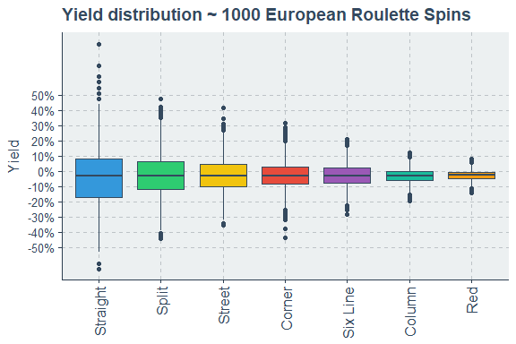
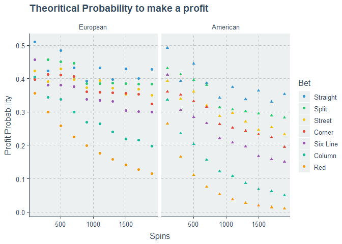
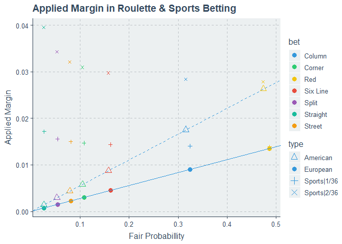
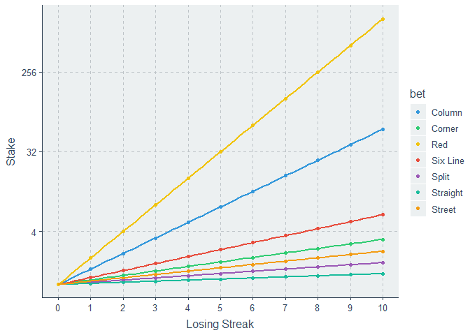
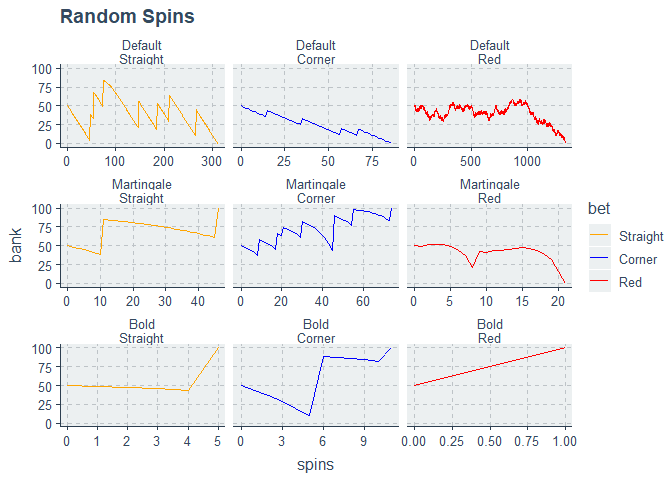
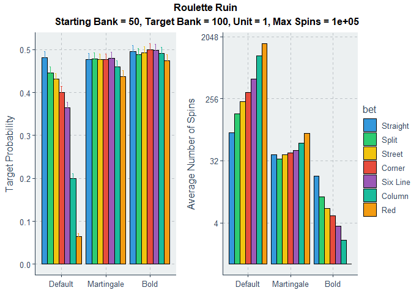
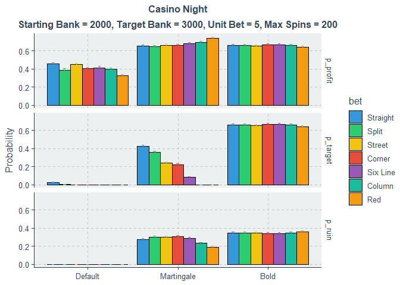

Roulette Strategy
================
Thanos Livanis
13/12/2023

**Analysis & simulation of *Gambler’s Ruin* problem in roulette under
different betting strategies & circumstances**

-   [Analysis](#analysis)
    -   [Profit & Loss](#pnl-distribution)
    -   [Profit Probability](#profit-probability)
    -   [Applied Margin](#applied-margin)
-   [Gambler’s Ruin](#gamblers-ruin-in-roulette)
    -   [Description](#description)
    -   [Martingale](#martingale)
    -   [Simulation](#simulation)
        -   [Roulette Ruin](#roulette-ruin)
        -   [Casino Night](#casino-night)

``` r
rm(list = ls())

library(reshape2)
library(tidyverse)
library(ggpubr)
library(ggthemr)

options(scipen = 999)

# types of roulette bets with different Payouts
roulette_table <- tribble(
  ~bet,       ~n,   ~payout,
  "Straight",  1,    35,  
  "Split",     2,    17,
  "Street",    3,    11,
  "Corner",    4,    8,
  "Six Line",  6,    5,
  "Column",    12,   2,
  "Red",       18,   1)

roulette_table <- bind_rows(roulette_table %>% mutate(type = "European"), 
                            roulette_table %>% mutate(type = "American")) %>%
  relocate(type, .before = bet) %>%
  mutate(prop = ifelse(type == "European", n/37, n/38), 
         EV = prop*(payout + 1) - 1)
```

## Analysis

### PnL Distribution

``` r
spin_wheel <- function(roulette, bet, nspins){
  
  params <- as.list(environment())
  
  id <- which(roulette_table$type == roulette & roulette_table$bet == bet)
  prop <- roulette_table$prop[id]
  payout <- roulette_table$payout[id]
  
  spins = rbinom(nspins, 1, prop)
  
  list(Yield = sum(ifelse(spins, payout, -1))/nspins) %>% bind_cols(params)
}

returns <- expand.grid(roulette = c("European", "American"),
                       bet = unique(roulette_table$bet),
                       trials = 1000) %>%
  pmap_dfr(function(roulette, bet, trials) {
    replicate(5000, spin_wheel(roulette, bet, trials), simplify = F) %>% bind_rows()})
```

``` r
ggthemr("flat")

returns %>% filter(roulette == "European") %>%
  ggplot(aes(x = bet, y = Yield, fill = bet)) +
  geom_boxplot() +
  scale_y_continuous(breaks = seq(-0.5, 0.5, 0.1), labels = scales::percent_format(accuracy=1)) +
  theme(axis.title.x = element_blank(), 
        axis.text.x = element_text(angle = 90, vjust = 0.5, hjust = 1,size = 12), 
        legend.position="none") +
  labs(title = "Yield distribution ~ 1000 European Roulette Spins")
```

<!-- -->

### Profit Probability

If we spin the Roulette N times and win M bets:
PnL = *M* ⋅ payout − (*N*−*M*). Thus:
$M > \\frac{N}{\\text{payout} + 1}$  
Profit Probability = *P*(*X*≥⌈*M*⌉) = pbinom(⌊*M*⌋,Spins,*p*,lower.tail = F)

It is easier to make a profit from Straight & Split bets than betting on
Red, due to higher variance.

``` r
prop_profit <- function(roulette, bet, nspins) {
  
  params <- as.list(environment())
  
  id <- which(roulette_table$type == roulette & roulette_table$bet == bet)
  prop <- roulette_table$prop[id]
  payout <- roulette_table$payout[id]
  
  list(p_profit = pbinom(floor(nspins/(payout + 1)), nspins, prop, lower.tail = F)) %>%
    bind_cols(params)
  
}

ggthemr("flat")

expand.grid(bet = unique(roulette_table$bet),
            roulette = c("European", "American"),
            nspins = seq(100, 2000, 200)) %>%
  pmap_dfr(prop_profit) %>%
  ggplot(aes(x = nspins, y = p_profit, color = bet, shape = roulette)) +
  geom_point() + 
  facet_wrap(roulette ~.) +
  guides(color = guide_legend(title = "Bet"), shape = "none") +
  labs(x = "Spins", y = "Profit Probability")
```

<!-- -->

### Applied Margin

Suppose that we bet on a single number (Straight Bet) in European
Roulette. The decimal odds are 36, fair odds are 37, and the fair
probability is 1/37. The rest of the numbers constitute a *compound
event*, with decimal odds, fair odds and fair probability 1, 37/36 and
36/37 respectively. The margin M is 1/36.

Thus fair odds of {37/36, 37} are mapped to roulette odds {1, 36},
$rouletteOdds > \\frac{fairOdds}{1 + M}$ 

**Contrary to Sports betting there isn’t any longshot bias**, where the
returns from long odds are smaller than short odds. Typically in Sports
betting a margin of 1/36 applied to fair probabilities of (1/37, 36/37),
would result in odds of {22.63, 1.016}, using a method called odds
ratio. 

Let’s visualize how the margin is applied to a probability event. The
margin of an event i with odds of o and probability p is:
$M_i = \\frac{1}{o} - p$. We will use the [implied
package](https://opisthokonta.net/?p=1797) to convert fair probabilities
to bookmaker’s odds by applying sequentially a margin of 1/36 and 2/36,
as in the case of European and American Roulette respectively.

``` r
ggthemr("flat")
library(implied)

sport_odds <- function(roulette) {
  
  # fair Roulette probabilities
  fair_props <- filter(roulette_table, type == roulette) %>% 
    mutate(com_prop = 1 - prop, 
           type = ifelse(roulette == "European",  "Sports|1/36", "Sports|2/36"))
  
  margin <- ifelse(roulette == "European", 1/36, 2/36)
  
  bookmakers_odds  <- implied_odds(fair_props[, c("prop", "com_prop")], "or", margin) %>% .[["odds"]] %>%
    as.data.frame() %>% select(1) %>% setNames("odds")
  
  odds <- bind_cols(fair_props, bookmakers_odds) 
}

odds <- map_dfr(list("European", "American"), sport_odds) 

# Applied Margin
ggplot() +
  geom_point(data = roulette_table, aes(x = prop, y = 1/(payout + 1) - prop, color = bet, shape = type), size = 3) + 
  geom_point(data = odds, aes(x = prop, y = 1/odds - prop, color = bet,  shape = type), show.legend = F) +
  geom_abline(intercept = 0, slope = 1/36, linetype = 1) + 
  geom_abline(intercept = 0, slope = 2/36, linetype = 2) + 
  scale_shape_manual(values = c("American" = 2, "European" = 16, "Sports|1/36" = 3, "Sports|2/36" = 4)) +
  labs(x = "Fair Probabillity", y = "Applied Margin", title = "Applied Margin in Roulette & Sports Betting")
```

<!-- -->

## Gamblers Ruin in Roulette

### Description

We will use a variation of the classic Gambler’s Ruin problem under
different betting strategies. In the classic scenario, a gambler starts
with an initial capital and on each game, the gambler wins 1 with
probability p or loses 1 with probability 1 − p. The gambler will stop
playing if either N dollars are accumulated or all money has been
lost.  

In our case the gambler starts with an initial capital & stops until he
is ruined, reaches his target or after a specified number of spins. He
has the option to bet on a Straight, Split, Red etc. There are three
betting strategies:

**1. Default**  
The gambler makes a constant bet, $n.

**2. Martingale**  
The gambler starting with $n, tries to cover all previous consecutive
losses and make a profit $(n\*payout). The strategy is typical for even
odds, where we double our initial stake, but can be extended to uneven
odds as well.

**3. Bold**  
The gambler bets his entire capital.

All betting strategies are limited by the current bank (we can’t bet
more than we have), we can’t bet more than the casino limit, and most
important **we never bet more money than we need to reach our target.** 
Thus the bold strategy doesn’t necessarily mean we always put all money.
If our current bank is 80, our target is 100 and we bet on red, we will
place $20.

### Martingale

Suppose that we bet 1$ to an event with payout p, expecting to make p
units profit, *S*<sub>0</sub> = 1. If we lose, in order to cover the
loss and make p units profit, the next bet has to be:
$S_1 = \\frac{p + 1}{p} = 1 + \\frac{1}{p}$. If
*S*<sub>*n* − 1</sub> = *x*<sup>*n* − 1</sup>, where
$x = 1 + \\frac{1}{p}$, then after n-1 consecutive loses,
$S_n = \\frac{p + x\_{0} + x\_{1} + \\cdots + x\_{n-1}}{p}$  
$S_n = \\frac{p + \\frac{1-x^n}{1-x}}{p} = 1 + \\frac{1 - x^n}{(1-x)p}$  
Substituting x, we get:  
$S_n = x^n = (1+\\frac{1}{p})^n$  

In the general case: $S_n = S_o(1+\\frac{1}{p})^n$  

``` r
ggthemr("flat")

martingale_stakes <- function(payout, consecutive_loses, unit) {
  
  params <- as.list(environment())[1:2]
  stake <- vector("double", consecutive_loses)
  
  for (i in seq_along(stake)) 
    stake[i] <- unit + sum(stake[1:(i-1)])/payout
  
  stake <- bind_cols(params, data.frame(stake = round(unit + sum(stake)/payout, 3))) 
}

expand.grid(payout = unique(roulette_table$payout),
            consecutive_loses = 0:15) %>%
  pmap_dfr(martingale_stakes, unit = 1) %>%
  left_join(roulette_table[roulette_table$type == "European", c("payout", "bet")], by = "payout") %>%
  ggplot(aes(x = consecutive_loses, y = stake, color = bet)) +
  geom_point() + 
  scale_x_continuous(breaks = 0:15) +
  scale_y_continuous(trans='log2') +
  labs(x = "Losing Streak", y = "Stake", title = "Martingale Stakes starting with 1$")
```

<!-- -->

### Simulation

``` r
# @params:
# @roulette: "European" | "American"
# @bet: {Straight, Split, Street...}
# @unit_bet: unit stake on Default Strategy and Martingale
# @max_bet: Casino limit

# @strategy: Default| Martingale | Bold
# Default: constant bet
# Martingale: Generalized martingale in uneven odds, where the current bet covers all previous losses
# Bold: Bet the whole bank
# All strategies limited by current bank, max bet allowed by casino and
# **We never bet more than we actually need to reach our target.**
play_roulette <- function(roulette, bet, starting_bank, target_bank, unit_bet, 
                          max_bet, max_spins, strategy, plot = F) {
  
  params <- as.list(environment())[1:8]
  
  id <- which(roulette_table$type == roulette & roulette_table$bet == bet)
  prop <- roulette_table$prop[id]; payout <- roulette_table$payout[id]
  
  current_bank <- starting_bank
  losing_streak <- 0
  
  series <- vector("double", max_spins + 1); stake <- vector("double", max_spins + 1)
  
  series[1] <- current_bank
  spins <- 0
  
  stake_fun <- function(strategy) {
    if (strategy == "Default")
      function(bank, payout, ls) unit_bet
    else if (strategy == "Martingale")
      function(bank, payout, ls) unit_bet*(1 + 1/payout)^ls
    else 
      function(bank, payout, ls) bank
  }
  
  while (current_bank > 0 && current_bank < target_bank && spins < max_spins) {
    
    spins <- spins + 1
    stake_limit <- min(max_bet, current_bank, (target_bank - current_bank)/payout)
    
    bet <- stake_fun(strategy)(current_bank, payout, losing_streak) %>% min(stake_limit)
    spin <- rbinom(1, 1, prop)
    
    losing_streak <- ifelse(spin, 0, losing_streak + 1)
    
    current_bank <- current_bank + bet*ifelse(spin, payout, -1)
    
    # update containers
    stake[spins] <- bet
    series[spins + 1] <- current_bank
  }
  
  #trim vectors
  stake <- c(stake[1:spins], 0)
  series <- series[1:(spins + 1)]
  
  sim <- data.frame(spins = 0:spins, 
                    bank = series, 
                    stake = stake) %>%bind_cols(params)
  
  if (plot) {
    pl <- ggplot(sim, aes(x = spins, y = bank)) + 
      geom_line(color = "red") + labs(title = "Roulette Spinning", 
                                      subtitle = paste(c("Bet", "Strategy"), "=",  c(bet, strategy), collapse = ", "))
    print(pl)
  }
  
  return (sim)
}
```

``` r
ggthemr("flat")

# Typical time Series
expand.grid(roulette = "European",
            bet = c("Straight", "Corner", "Red"),
            starting_bank = 50,
            target_bank = 100, 
            unit_bet = 1,
            max_bet = 100, 
            max_spins = 10^5,
            strategy = c("Default", "Martingale", "Bold")) %>%
  pmap_dfr(play_roulette) %>%
  ggplot(aes(x = spins, y = bank, color = bet)) +
  geom_line() +
  scale_color_manual(breaks = c("Straight", "Corner", "Red"),
                     values=c("orange", "blue", "red")) +
  facet_wrap(strategy ~ bet, scales = "free_x") +
  theme(strip.text.x = element_text(margin = margin(l = 0))) +
  ggtitle("Random Spins")
```

<!-- -->

``` r
# Simulate roulette round several times and & extract stats
# Probability to reach target, to make a profit & to go bankrupt
simulate <- function(roulette, bet, starting_bank, target_bank, unit_bet, max_bet, max_spins, strategy) {
  
  set.seed(1)
  nsims <- 5000
  
  mc_results <- replicate(nsims, play_roulette(roulette, bet, starting_bank, target_bank, 
                                               unit_bet, max_bet, max_spins, strategy), 
                          simplify = F) %>%
    map_dfr(~tail(., 1)) %>%
    group_by(across(4:11)) %>%
    summarize(p_profit = mean(bank > starting_bank),
              p_profit_se = sqrt(p_profit*(1-p_profit)/nsims),
              
              p_target = mean(bank >= target_bank), 
              p_target_se = sqrt(p_target*(1-p_target)/nsims),
              
              p_ruin = mean(bank == 0), 
              p_ruin_se = sqrt(p_ruin*(1-p_ruin)/nsims),
              
              bank_exp = mean(bank),
              
              spins_exp = mean(spins),
              spins_exp_se = sd(spins)/sqrt(nsims),
              spins_longest = max(spins),
              
              .groups = "drop") 
}
```

#### Roulette Ruin

Let’s simulate a variance of Gambler’s Ruin. In the below simulation,
given the large number of spins, the gambler plays until he reaches his
target or is ruined under the three strategies.

The results can be summarized this way: In a game with a negative
expected value, where we play until the end, we have to limit the number
of trials; otherwise, the law of large numbers leads us to ruin. The
best strategy in this case is the bold strategy.

``` r
params_ruin <- expand.grid(roulette = "European",
                           bet = unique(roulette_table$bet),
                           starting_bank = 50,
                           target_bank = 100, 
                           unit_bet = 1,
                           max_bet = 1000, 
                           max_spins = 10^5,
                           strategy = c("Default", "Martingale", "Bold"))

sim_ruin <- params_ruin %>%
  pmap_dfr(simulate, .progress = T)

ggthemr("flat")

pl_prop <- sim_ruin %>% 
  ggplot(aes(x = strategy, y = p_target, fill = bet)) +
  geom_bar(stat = "identity", position = "dodge", color = "black") +
  geom_errorbar(aes(ymin = p_target - 1.96*p_target_se, ymax = p_target + 1.96*p_target_se, color = bet),  
                width = .2, position = position_dodge(.9), show.legend = F) + 
  labs(y = "Target Probability") +
  theme(axis.title.x = element_blank()) 

pl_spins <- sim_ruin %>% 
  ggplot(aes(x = strategy, y = spins_exp, fill = bet)) +
  geom_bar(stat="identity", position = "dodge", color = "black") +
  scale_y_continuous(trans='log2') +
  labs(y = "Average Number of Spins") +
  theme(axis.title.x=element_blank())


pl <- ggarrange(pl_prop, pl_spins, ncol = 2, common.legend = T, legend = "right")
annotate_figure(pl, top = text_grob(paste("Roulette Ruin\n", 
                                          paste(c("Starting Bank", "Target Bank", "Unit", "Max Spins"), "=",
                                                c(unique(sim_ruin$starting_bank), unique(sim_ruin$target_bank), 
                                                  unique(sim_ruin$unit_bet), unique(sim_ruin$max_spins)),
                                                                  collapse = ", ")), 
                                    face = "bold", size = 12))
```

<!-- -->

#### Casino Night

A simulation of a night at Casino. Gambler walks in with $2000 and he
will try at most 200 spins under the 3 strategies. He aims for $3000 and
unit bet is $5.

``` r
params_real <- expand.grid(roulette = "European",
                           bet = unique(roulette_table$bet),
                           starting_bank = 2000,
                           target_bank = 3000, 
                           unit_bet = 5,
                           max_bet = 1000, 
                           max_spins = 200,
                           strategy = c("Default", "Martingale", "Bold"))

sim_real <- params_real %>%
  pmap_dfr(simulate, .progress = T)

ggthemr("flat")

sim_real %>% melt(measure.vars = c("p_profit", "p_target", "p_ruin")) %>%
  mutate(se = ifelse(variable == "p_profit", p_profit_se, ifelse(variable == "p_target", p_target_se, p_ruin_se))) %>%
  ggplot(aes(x = strategy, y = value, fill = bet)) +
  geom_bar(stat = "identity", position = "dodge", color = "black") +
  geom_errorbar(aes(ymin = value - 1.96*se, ymax = value + 1.96*se, color = bet),  
                width = .2, position = position_dodge(.9), show.legend = F) + 
    facet_grid(variable ~.) +
  labs(y = "Probability", title = "Casino Night", 
       subtitle = paste(c("Starting Bank", "Target Bank", "Unit Bet", "Max Spins"), "=",
                        c(unique(sim_real$starting_bank), unique(sim_real$target_bank), 
                          unique(sim_real$unit_bet), unique(sim_real$max_spins)), 
                        collapse = ", ")) +
  theme(axis.title.x=element_blank(), plot.title = element_text(size = 12, face = "bold", hjust = 0.5), 
        plot.subtitle = element_text(size = 12, face = "bold", hjust = 0.5))  
```

<!-- -->
